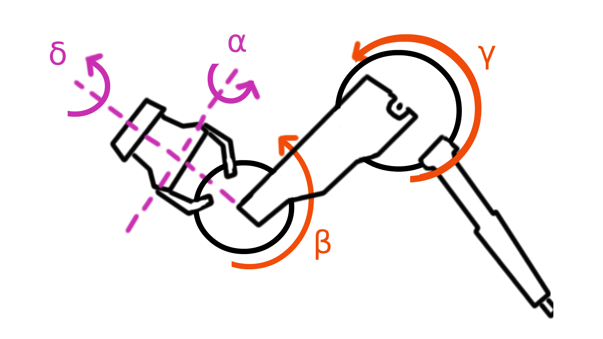
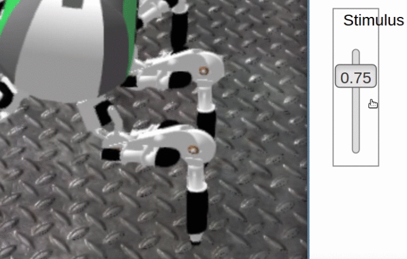
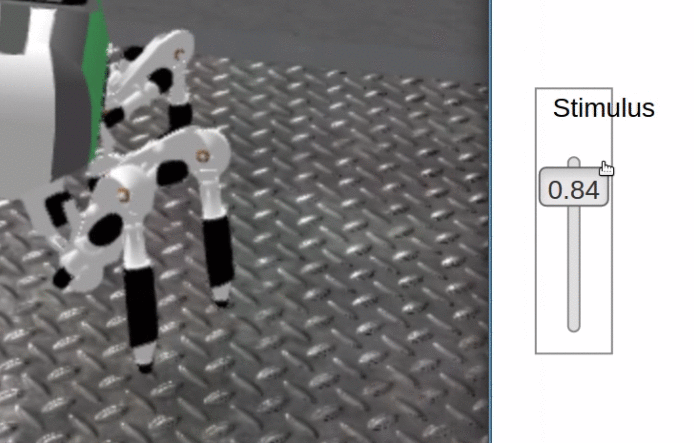
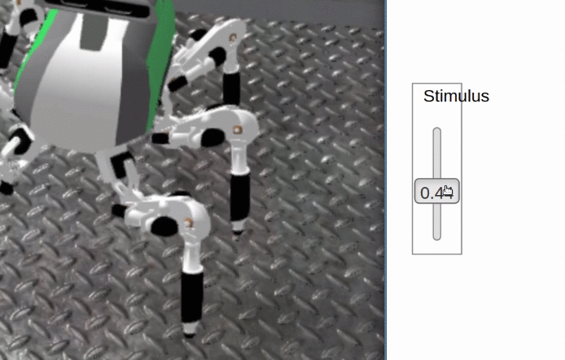
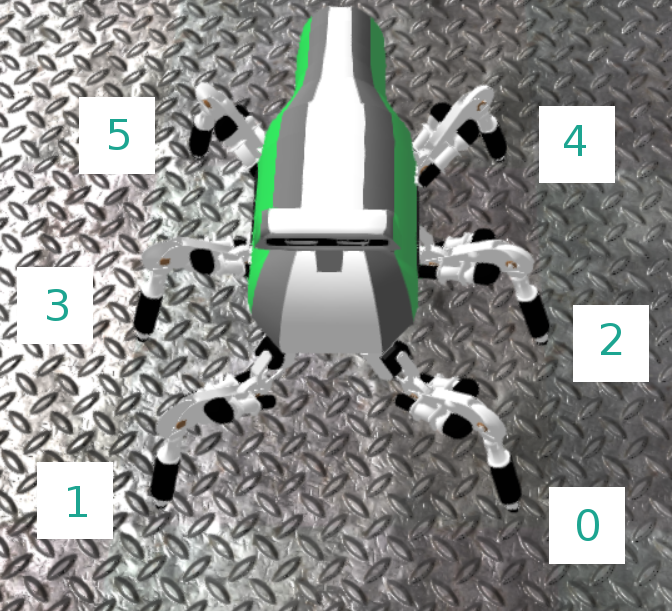

# Table of Contents
- [LAURON Locomotion Challenge for NRP](#lauron-locomotion-challenge-for-nrp)
- [Contents and folder structure](#contents-and-folder-structure)
- [Background and dependecies](#background-and-dependecies)
	- [What's QWOP?](#whats-qwop)
	- [QWOP for the NRP](#qwop-for-the-nrp)
	- [ROS](#ros)
	- [Nengo](#nengo)
- [Usage of the frameworks](#usage-of-the-frameworks)
- [Known issues](#known-issues)

# LAURON Locomotion Challenge for NRP
---

This repository includes the needed files for the locomotion challenge "Lauron QWOP". During this challenge you'll be asked to implement a learning procedure to make the robot named LAURON walk. You can choose to either use neural learning, classical machine learning and planning or something different. Most of these methods are reward based approaches where you have to define a reward function to reinforce good and to punish bad states. Possible criteria are movement speed, distance or movement direction. Feel free to implement your own ideas. Different approaches often result in different results which makes the solutions so interesting. We provide some motion primitives which should be used for the locomotion.

Please only use this repo for the **challenge definition** and not for solutions. Fork to implement your solution.

# Contents and folder structure
During this introduction we'll setup some dependecies because we'll need some 3rd party frameworks and libraries. Moreover we'll add a new experiment to the list of existing experiments and modify one of the installed models.
Thereby we have prepared several folders:

- Experiments (size: 30.740 Byte)
  - lauron_snn (size: 24.592 Byte)
- IPython Tutorials (size: 7.872.447 Byte)
  - img (size: 7.849.264 Byte)
- Nengo (size: 6.902 Byte)
- Models (size: 27.754.725 Byte)
  - lauron_model (27.748.577 Byte)
    - meshes (size: 27.348.361 Byte)
      - leg (size: 26.985.029 Byte)

The experimentsfolder contains the experiment. You'll need to copy or link that folder to your NRP experiments. Therefore enter the source folder of this repository and enter the following commands:
```
mkdir $HBP/oldExperiments
mv $HBP/Experiments/lauron_snn $HBP/oldExperiments/lauron_snn
cp -r Experiments/lauron_snn $HBP/Experiments/lauron_snn
```

The Nengo folder provides the motion primitive factory for LAURON and a test script for nengo. You'll need to copy or link that folder to your NRP root using:
```
cp -r Nengo $HBP/Nengo
```

The Models folder contains important files for the LAURON model used in the NRP. You'll need to copy that folder to your NRP models using:
```
mkdir $HBP/oldModels
mv $HBP/Models/lauron_model $HBP/oldModels/lauron_model
cp -r Models/lauron_model $HBP/Models/lauron_model
```
The IPython Tutorials folder contains mostly the same information as this readme file. If you want to read the notebooks you can start the engine with `jupyter notebook` (http://jupyter.org/).

After copying the files to the NRP you should be able to see the experiment "Locomotion Challenge - Lauron QWOP" in your frontend experiments list. In case you do not see the experiment try to add the parameter `?dev` to your URL and reload the page.

# Background and dependecies
This challenge uses ROS and Nengo. If you're not familiar with the robot family developed at FZI Karlsruhe we'll also introduce a six legged robot named LAURON. This biological inspired robot was designed to research stable gaits through odd terrain but due to simplicity we'll only use flat terrains during this challenge.

In the following we'll describe the contents of this challenge and we'll introduce the used frameworks and libraries.

## What's QWOP?
QWOP is a 2008 ragdoll-based browser video game created by Bennett Foddy, formerly bassist of Cut Copy. Players control an athlete named "Qwop" using only the Q, W, O, and P keys. A couple of years after the game was released on the internet, the game became an internet meme after its outbreak in December 2010. The game helped Foddy's site (Foddy.net) reach 30 million hits. [1]

Because videos say more than thousands words so simply watch this video to understand how the QWOP-Game works:

<p align="center">
  <a href="https://youtu.be/VJeJtK7Q2kk">
  	
  </a>
</p>

### Gameplay and reception
Players play as an athlete named "Qwop", who is participating in a 100-meter event at the Olympic Games. Using only the Q, W, O and P keys, players must control the movement of the athlete's legs to make the character move forward while trying to avoid falling over. The Q and  W keys each drive one of the runner's thighs, while the O and P keys work the runner's calves. The Q key drives the runner's right thigh forward and left thigh backward, and the W key also affects the thighs and does the opposite. The O and P keys work in the same way as the Q and W keys, but with the runner's calves. The actual amount of movement of a joint is affected by the resistance due to forces from gravity and inertia placed upon it. [1]

Though the objective of QWOP is simple, the game, ever since it was released, has been notorious for being difficult to master due to its controls with the Q, W, O and P keys. Foddy says that he gets a lot of hate mail for making QWOP. Despite the criticism for the game's difficulty due to the controls, the game helped Foddy's site reach 30 million hits, according to Wired Magazine, and, also ever since the game was released, has been played by millions of people, although numbers have declined. [1]

## QWOP for the NRP
To get you started, here some LAURON basics you will need to know about.
We implemented several motion primitives which can be used like the primitives behind the Q, W, O and P keys. Therefore we use the following joints:

<p align="center">
  
</p>

We defined the following primitives:
1. Swing motion: The Swing primitive will return values for the alpha and delta joints in order to swing the leg forward and backward.
2. Lift leg: The Lift Leg primitive will return values for the beta and gamma joints in order to lift the leg/foot.
3. Stance: The Stance primitive will return values for the beta joints in order to stance into the ground to lift Laurons body up.

<p align="center">
  

  

  
</p>

You can use each motion primitive with a stimulus in [0,1]. We will map that value to one of the corresponding joint-bounds:
<p align="center">

  |           |   **swing**   | **lift leg**| **stance** |
  |-----------|:-------------:|:-----------:|:----------:|
  | **alpha** | -0.25 to 0.25 |      /      |      /     |
  | **beta**  |       /       | 1.5 to 3.14 | 1.0 to 1.5 |
  | **gamma** |       /       | -3.14 to -2 |      /     |
  | **delta** | -0.25 to 0.25 |      /      |      /     |

</p>

These values will be sent to the NRP via rospy and Nengo. It is possible to send each primitive to each leg. Since it is also important to know which leg is which, here is a graphic. This will be important because you will need different values for different legs.

<p align="center">
  
</p>

## ROS
The [Robot Operating System (ROS)](http://www.ros.org) is a flexible framework for writing robot software. It is a collection of tools, libraries, and conventions that aim to simplify the task of creating complex and robust robot behavior across a wide variety of robotic platforms. [5]
Although ROS is not an operating system, it provides services designed for heterogeneous computer cluster such as hardware abstraction, low-level device control, implementation of commonly used functionality, message-passing between processes, and package management. Running sets of ROS-based processes are represented in a graph architecture where processing takes place in nodes that may receive, post and multiplex sensor, control, state, planning, actuator and other messages. [4]

Please visit the [official ROS homepage](http://www.ros.org) if you want to learn more about ROS.

### Installing missing ROS packages
For our challenge we defined new rostopic to publish on, namely:
- robot_leg0_delta_joint_pos_cntr
- robot_leg0_alpha_joint_pos_cntr
- robot_leg0_beta_joint_pos_cntr
- robot_leg0_gamma_joint_pos_cntr
- robot_leg1_delta_joint_pos_cntr
- robot_leg1_alpha_joint_pos_cntr
- robot_leg1_beta_joint_pos_cntr
- robot_leg1_gamma_joint_pos_cntr
- robot_leg2_delta_joint_pos_cntr
- robot_leg2_alpha_joint_pos_cntr
- robot_leg2_beta_joint_pos_cntr
- robot_leg2_gamma_joint_pos_cntr
- robot_leg3_delta_joint_pos_cntr
- robot_leg3_alpha_joint_pos_cntr
- robot_leg3_beta_joint_pos_cntr
- robot_leg3_gamma_joint_pos_cntr
- robot_leg4_delta_joint_pos_cntr
- robot_leg4_alpha_joint_pos_cntr
- robot_leg4_beta_joint_pos_cntr
- robot_leg4_gamma_joint_pos_cntr
- robot_leg5_delta_joint_pos_cntr
- robot_leg5_alpha_joint_pos_cntr
- robot_leg5_beta_joint_pos_cntr
- robot_leg5_gamma_joint_pos_cntr

Each topic corresponds to a unique joint of a unique leg. In order to access these topics using rospy, you may need to install a few more libraries:
```
sudo apt-get install ros-kinetic-joint-state-controller
sudo apt-get install ros-kinetic-effort-controllers
sudo apt-get install ros-kinetic-position-controllers
```

After that it is possible to create an publisher node via python and to publish data in order to control the joints. You'll find more about how to publish data to the NRP at the end of this readme.

## Nengo
[Nengo](https://www.nengo.ai/download.html) is a graphical and scripting based software package for simulating large-scale neural systems. The book How to build a brain, which includes Nengo tutorials, is now available. This website also has additional information on the book. [2]

To use Nengo, you define groups of neurons in terms of what they represent, and then form connections between neural groups in terms of what computation should be performed on those representations. Nengo then uses the Neural Engineering Framework (NEF) to solve for the appropriate synaptic connection weights to achieve this desired computation. Nengo also supports various kinds of learning. Nengo helps make detailed spiking neuron models that implement complex high-level cognitive algorithms. [2]

Among other things, Nengo has been used to implement motor control, visual attention, serial recall, action selection, working memory, attractor networks, inductive reasoning, path integration, and planning with problem solving (see the model archives and publications for details). [2]

### Installing Nengo
Set up a virtual environment (https://virtualenv.pypa.io/en/stable/) instead of installing nengo locally. This avoids problems with installed packages. **$venv_name will be the name of the virtual enviroment you create**.

#### Create virtual environment
```
virtualenv $venv_name
source $venv_name/bin/activate
```

this will activate the virtual enviroment, (`$venv_name`) will appear left of the prompt. You can always leave the virtual environment using the command `deactivate` and enter it again using the command `source $venv_name/bin/activate`.

#### Install Nengo
Please make sure that you are using the virtual environment.
Simply install Nengo using the commands:
```
pip install nengo
pip install nengo_gui
```

#### Install modules needed for usage with ros
Because it is a fresh installation a lot of other modules are missing

```
source /opt/ros/kinetic/setup.bash (kinetic or other ros distribution)
pip install pyyaml
pip install rospkg
pip install catkin_pkg
```

In order to use Nengo with ros, you'll also have to make changes in the *main.py* at `$venv_name/lib/python2.7/site-packages/nengo_gui`
```
import rospy
```

and add the following right before `s.start()` is called
```
rospy.init_node('nengo_ros')
```

### Start Nengo
The Nengo GUI is a web-based interface for designing and running Nengo models. To start the GUI, open a terminal, enter the virtual environment and run the `nengo` command. There is a build in tutorial with a lot of examples at `$venv_name/lib/python2.7/site-packages/nengo_gui/examples/tutorial/`

To access the GUI, you use a web browser like Google Chrome or Firefox. You should see a depiction of the network on the left panel, and a code editor on the right panel.

<p align="center">
  
</p>

The network illustration on the left panel is interactive. You can drag to move the network objects, scroll with the mouse to zoom in and out, and right-click on objects to display plots that will update in real time as the model simulates. [3]

The code editor on the right panel shows the Python code defining the Nengo model. While you can write any Python code in this editor, we add a few additional constraints to ensure the GUI runs smoothly: [3]

1. Your top-level network must be called model.
2. You cannot construct a Simulator object, as the GUI makes its own Simulator under the hood.
3. You cannot show plots created with Matplotlib, as the GUI has its own set of visualizations.

For more information please read the [GUI documentation](https://github.com/nengo/nengo_gui#basic-usage) or the [user guide](https://www.nengo.ai/users.html).

# Usage of the frameworks
We provide several motion primitives. If your learning procedure uses these primitives in the right order and with the right stimuli LAURON should perform a fast and stable gait. Possible gaits are tripod, ripple or wave but most of the automated learning procedures perform a free gait following the reward function.

<p align="center">
  <a href="https://www.youtube.com/watch?v=bPzRKIHpLs8"></a>
</p>

If you don't want to use our motion primitives you may want to take a look at alternative methods for walking like the [cruse rules](https://www.researchgate.net/figure/The-rules-of-leg-coordination-that-have-been-described-for-stick-insect-walking-1-swing_fig1_8910313) for six-legged insects. For insect walking behaviour, six coordination rules have been described:
1. swing movement inhibits start of swing movement
2. start of stance movement excites start of swing movement
3. caudal positions excite start of swing movement
4. position influences position at end of swing movement (‘‘target- ing’’)
5. increased load prolongs stance movement, increased resistance increases force (‘‘coactivation’’)
6. treading-on-tarsus (TOT) reflex; grey arrows : contralateral (intrasegmental) influences (‘‘c’’ in the text), black arrows : ipsilateral influences (‘‘i’’ in the text); lFL left front leg, lML left midle leg, lHL left hind leg, rFL right front leg, rML right middle leg, rHL right hind leg [6]

<p align="center">
  
</p>

No matter which approach you use you should implement your solution using python and Nengo. Therefore you have to import `motionPrimitives.py` and create an motion primitive object using:
```python
import motionPrimitives as mp

swing = mp.MotionPrimitives(0,stimulus, joints)
liftLeg = mp.MotionPrimitives(1,stimulus, joints)
stance = mp.MotionPrimitives(2,stimulus, joints)
```

These objects also provide nengo networks which can be used for interaction:
```python
model = nengo.Network()
with model:
    net_swing = swing.get_network()
    net_liftleg = liftleg.get_network()
    net_stance = stance.get_network()
```

The stimulus can be either a simple float or a function returning a float e.g sinus where `t` means the current time coming from nengo.
```python
import numpy as np
def sinus(t):
    return np.sin(t * np.pi)
```

If you want to publish a stimulus on more joints you can do so.
Those `pubOnlyJoints` wil receive the exact same value in the same order as joints
```python
swing = mp.MotionPrimitives(0,stimulus, joints, pubOnlyJoints)
liftLeg = mp.MotionPrimitives(1,stimulus, joints, pubOnlyJoints)
stance = mp.MotionPrimitives(2,stimulus, joints, pubOnlyJoints)
```

There's also a minimal example called `testPrimitives.py`. You can run it after entering the virtual environment using:
```
nengo testPrimitives.py
```


# Known issues
- You might need to start the experiment, then restart it again in order for lauron to stand and not sack to the ground

# References
[1] https://en.wikipedia.org/wiki/QWOP (last visited 12.02.2018)

[2] https://www.nengo.ai (last visited 12.02.2018)

[3] https://www.nengo.ai/users.html (last visited 12.02.2018)

[4] https://en.wikipedia.org/wiki/Robot_Operating_System (last visited 12.02.2018)

[5] http://www.ros.org (last visited 12.02.2018)

[6] https://www.researchgate.net/figure/The-rules-of-leg-coordination-that-have-been-described-for-stick-insect-walking-1-swing_fig1_8910313 (last visited 15.02.2018)
